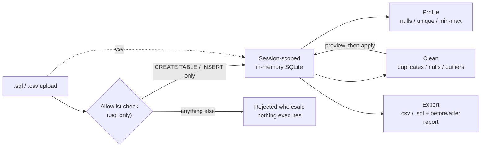

# Datasweep

A dataset-agnostic SQL data profiler and cleaner. Upload a `.sql` dump or
`.csv` file, get a schema profile, null/duplicate/outlier detection, and a
cleaned export - no assumptions about what the data is about.

This is a companion piece to a separate data-*analytics* portfolio project;
Datasweep is the data-*engineering* / tool-building half. It works with any
tabular dataset by design.

**Status:** feature-complete, deploy-ready, verified from a clean install,
and stress-tested against a real 1.1MB SQL Server production dump (not a
synthetic test file) with zero failures on the 3,321 loadable statements.
Upload -> profile -> clean -> export all work end to end, hardened for a
public anonymous demo, and confirmed working by wiping every dependency
and re-running the documented setup from scratch (see Roadmap, step 9, for
the real bug that caught). See "Real-world T-SQL dump compatibility" below
for what a genuine SQL Server export actually requires and why. What's
left is actually deploying it and linking it from a portfolio.

## Why this exists

Data cleaning is most of what an analyst's time actually goes to, and it's
usually invisible in portfolios. Datasweep makes that process a first-class,
demoable tool instead of a hidden step.



## Architecture decisions (step 1)

| Layer | Choice | Why |
|---|---|---|
| Frontend | React + Vite | Reuses the design system/components from the companion dashboard project for a consistent portfolio identity |
| Backend | Node + Express | Same language across the stack; keeps the project approachable to review |
| Database | SQLite (`better-sqlite3`), one **in-memory instance per session** | The core safety decision - see below |
| Session identity | UUID issued per client, round-tripped via an `x-datasweep-session` header | No cookies/auth needed for an anonymous demo tool |

### The sandboxing decision

The riskiest part of "upload a file and run it against a database" is letting
one visitor's file affect another visitor, or a shared database. Datasweep
avoids that at the architecture level rather than trying to filter bad input:

- Every session gets its **own SQLite database, held only in memory**
  (`src/db/sessionStore.js`). Nothing is shared or persisted across sessions.
- Idle sessions are destroyed automatically after 15 minutes.
- When `.sql` file parsing is added (next step), it will only ever accept
  `CREATE TABLE` / `INSERT` statements - never arbitrary SQL execution - so an
  uploaded file can populate a sandbox but never reach outside it.

This means even a malicious or malformed upload can, at worst, break its own
disposable session - not the server, and not anyone else's data. Tested
directly: a `.sql` file with a `DROP TABLE` mixed in among valid statements
never executes the `DROP` -- it's classified as disallowed and simply
skipped, while the legitimate `CREATE TABLE`/`INSERT` statements around it
still load normally (see `backend/src/sql/allowlistParser.js` and "Real-world
T-SQL dump compatibility" below for why this changed from an earlier
all-or-nothing reject).

### Cleaning safety

Every cleaning action (remove duplicates, handle nulls, remove outliers) is
destructive by nature, so two rules apply everywhere in `backend/src/sql/cleaner.js`:

- **Preview before apply.** Duplicate and outlier detection are separate,
  read-only endpoints from the ones that actually delete/update rows. The
  UI always shows what *would* happen before offering the button that
  makes it happen.
- **One-snapshot reset.** The moment a table is loaded, an internal
  `__original` copy is taken (exact schema preserved, not just an
  approximation - see the type-preservation note below). Any table can be
  reset back to exactly what was uploaded, at any point, no matter how many
  cleaning actions ran in between.

One real bug this caught during testing, worth keeping in mind if you extend
this: SQLite's `CREATE TABLE ... AS SELECT` doesn't reliably preserve
declared column types (an `INTEGER` column came back as `INT` after a
reset), which silently broke numeric-only actions like outlier detection
against a reset table. Fixed by having the snapshot/reset functions reuse
the original `CREATE TABLE` statement text (from `sqlite_master`) instead
of relying on `AS SELECT`, plus switching every numeric check in the
codebase from an exact string match to a type-*affinity* check
(`backend/src/sql/types.js`) so it can't happen again elsewhere.

### Hardening (step 6)

`better-sqlite3` is synchronous -- every query blocks Node's single thread
until it finishes. That reshapes what "hardening" actually means here: a
**request timeout can't help** against an expensive upload already being
processed, because nothing can preempt synchronous work in progress. It can
only close idle/hung connections (`server.setTimeout(30_000)` in
`server.js`), which is worth having but isn't the real fix.

The real fix is refusing the expensive work outright, before it starts:

- **Row/statement caps** (`MAX_ROWS = 50,000` in `csvLoader.js`, reused for
  `.sql` statement counts in `upload.js`) -- an oversized file is rejected
  with a 413 before any parsing or DB writes happen, so it can never block
  the event loop for other users.
- **Upload-specific rate limiting** (`middleware/rateLimit.js`) -- a
  tighter limit (20 / 15 min per IP) on `/api/upload` specifically, on top
  of a broader general-API limit (300 / 15 min), since uploads are the one
  endpoint doing real work.
- **Session ceiling** (`MAX_SESSIONS = 200` in `sessionStore.js`) -- each
  session holds a live in-memory SQLite instance, so unbounded session
  creation is itself a memory-exhaustion path independent of file size.
  Past the ceiling, the least-recently-used session is evicted to make room
  for a new one.

All three were verified directly rather than assumed: an oversized CSV
returns a 413 immediately, the 21st upload within the rate-limit window
returns 429 with the same session, and creating 205 sessions against a cap
of 200 leaves exactly 200 active with the oldest evicted.

## Project structure

```
Datasweep/
├── package.json                root convenience script (npm run dev -- both servers)
├── render.yaml                 Render deployment blueprint (backend)
├── LICENSE                     MIT
├── frontend/                  React + Vite
│   ├── src/
│   │   ├── App.jsx             app shell + backend connectivity check
│   │   ├── index.css            design tokens (shared w/ dashboard project)
│   │   ├── components/          ThemeToggle, Section, ControlPanel (reused chrome)
│   │   └── hooks/useTheme.js
│   └── .env.development         VITE_API_URL for local dev
│
└── backend/                   Express + SQLite
    └── src/
        ├── server.js            app entrypoint, CORS, error handling, connection timeout
        ├── middleware/
        │   ├── session.js       issues/reads the per-client session id
        │   └── rateLimit.js     general + upload-specific rate limits
        ├── db/sessionStore.js      per-session in-memory SQLite (the core decision)
        ├── sql/
        │   ├── allowlistParser.js  splits, normalizes (GO/T-SQL quirks), and classifies statements as allowed/skipped
        │   ├── csvLoader.js        CSV parsing + column type inference
        │   ├── introspect.js       reads back schema (tables/columns/row counts)
        │   ├── profiler.js         per-column stats: nulls, uniqueness, min/max/avg, samples
        │   ├── cleaner.js          duplicates, null handling, outliers, snapshot/reset
        │   ├── types.js            shared type-affinity helpers (see note below)
        │   └── exporter.js         .csv/.sql export + before/after cleaning report
        └── routes/
            ├── health.js         GET /api/health
            ├── session.js        GET /api/session/ping, GET /api/schema
            ├── upload.js         POST /api/upload -- .sql or .csv, 10MB cap
            ├── profile.js        GET /api/profile -- deep per-column stats
            ├── clean.js          duplicate/null/outlier preview+apply, reset
            └── export.js         GET /api/export/:table/{csv,sql,report}
```

## Running it locally

**One command** (installs and runs both):
```bash
npm run install:all
npm run dev
# backend  -> http://localhost:4000
# frontend -> http://localhost:5173
```

**Or separately**, if you want them in different terminals:

**Backend**
```bash
cd backend
npm install
cp .env.example .env   # already provided with sane local defaults
npm run dev
# -> http://localhost:4000
```

**Frontend** (separate terminal)
```bash
cd frontend
npm install
npm run dev
# -> http://localhost:5173
```

Open the frontend URL - the status pill in the header confirms the backend
connection and proves a real sandboxed database session round-trips a query
successfully.

## Deploying

The frontend is a static Vite build; the backend is a small Node/Express
process. They deploy separately.

**Backend (Render)** - a `render.yaml` blueprint is included at the repo
root. In Render: New → Blueprint → point at this repo. It builds from
`backend/` and runs `npm start`. After the first deploy, note the backend's
URL (e.g. `https://datasweep-backend.onrender.com`) - you'll need it for the
frontend build. (Railway or Fly.io work just as well; `render.yaml` is just
the one included as an example.)

**Frontend (Vercel or Netlify)** - point either at the `frontend/` directory
as the project root. Build command `npm run build`, output directory `dist`.
Set the build-time environment variable:
```
VITE_API_URL=https://your-backend-url.onrender.com
```

**Then close the loop on CORS** - set the backend's `FRONTEND_ORIGIN`
environment variable (in Render's dashboard, not `.env`, since `.env` isn't
committed) to your deployed frontend's URL, and redeploy the backend. Until
this is set, the deployed frontend will show "backend unreachable" even
though the backend itself is up, because the CORS check in `server.js`
rejects the mismatched origin.

## Tested against genuinely different datasets

The point of this tool is that it doesn't know or care what the data is
about - so it was deliberately tried against data that has nothing to do
with the retail dataset used during development, plus a few adversarial
inputs, all via real HTTP requests against the running server (not just
unit tests):

| Fixture | What it proved |
|---|---|
| An education CSV (students/majors/GPA) | Different domain, mixed types, embedded commas inside a quoted field (`"Art, Design"`), an apostrophe in a name, sparse nulls - all handled correctly |
| A multi-table `.sql` dump (`authors` + `books`, with a `FOREIGN KEY`) | The allowlist parser and profiler both work across relational schemas, not just flat single-table CSVs; each table is independently profilable, cleanable, and exportable |
| A CSV with quoted commas, escaped `""` quotes, an embedded newline inside a field, and Unicode (`café`, `édition`) | Parsing and the exported round-trip both preserve these correctly |
| A `.sql` file with a duplicate `PRIMARY KEY` insert | Correctly rejected with SQLite's own constraint error, and the whole upload rolled back rather than partially applying |
| A deliberately ragged CSV (wrong field count on one row) | Rejected with a precise, row-numbered error instead of silently misaligning columns |

Zero unhandled exceptions across any of these - every failure case returned
a clean 4xx with a specific message, not a stack trace or a 500.

## Real-world T-SQL dump compatibility

The test above covers dialect *variety*; this covers dialect *reality*.
Actual SQL Server dumps (the kind SSMS produces via "Generate Scripts")
don't look like tidy ANSI SQL, and a real one exposed several genuine gaps.
Tested against the official Microsoft Northwind sample database script
(`instnwnd.sql`, ~1.1MB, 13 tables, 3,300+ data statements) via real HTTP
requests -- not a converted or pre-cleaned copy, the actual file:

**What broke on the first attempt, and why:**

| Problem | Root cause | Fix |
|---|---|---|
| Whole file treated as one "statement" | SQL Server scripts often use `GO` as a batch separator instead of semicolons -- this file has zero semicolons in 9,350 lines | `GO`-on-its-own-line is now a statement boundary, same as `;` |
| Only ~250 of 3,300+ inserts detected | Bulk `INSERT` sections put one statement per line with *no* separator at all between them, not even `GO` | Added a paren-depth-aware heuristic: if we're not mid-expression and the next line opens with a new SQL keyword, that's an implicit boundary |
| `INSERT "table" (...)` rejected by SQLite | T-SQL allows omitting `INTO`; SQLite requires it | Normalized to `INSERT INTO` |
| `PRIMARY KEY CLUSTERED` syntax error | `CLUSTERED`/`NONCLUSTERED` are T-SQL-only, no SQLite equivalent | Stripped |
| `dbo.Employees` / `[dbo].[Region]` errors | SQLite has no concept of a `dbo` schema | Schema qualifier stripped |
| `getdate()` unknown function | Not a SQLite function | Mapped to `CURRENT_TIMESTAMP` |
| `) ON [PRIMARY]` syntax error | T-SQL filegroup placement, meaningless outside SQL Server | Stripped |
| `0x151C2F...` hex literal too big | T-SQL's unquoted hex-literal syntax isn't a SQLite blob literal | Converted to SQLite's `X'...'` form |
| Every insert failing with `FOREIGN KEY constraint failed` | `better-sqlite3` defaults `foreign_keys` **ON** (vanilla SQLite defaults it off) -- self-referencing rows and file-order forward references broke immediately | Foreign keys are now off for session databases, the same reason real restore tools (`pg_restore`, `mysqldump` imports) disable FK checks during bulk load |
| Snapshot/reset broke on `"Order Details"` and `[Region]` | The regex that renames a table for its `__original` snapshot only matched bare-word identifiers -- it silently failed (a no-op, not an error) on any name with a space or bracket-quoting, causing a duplicate-table error | Regex now matches double-quoted, bracket-quoted, and bare identifiers |

**The bigger product decision this forced:** the original design rejected
an entire upload if *any* statement wasn't `CREATE TABLE`/`INSERT` --
reasonable for a small clean file, useless for a real admin script that's
mostly stored procedures and views with the actual data mixed in. Uploads
now classify every statement as allowed or skipped and execute each
allowed one independently (not one all-or-nothing transaction), returning
a `loadSummary` (`executedCount` / `skippedCount` / `failedCount`, with
examples of each) instead of a single pass/fail. A file can partially load
and tell you exactly what it did and didn't do -- which is what actually
happened the first few times against this file, and is why the table above
exists instead of just a "fixed it" changelog line.

**Result:** 3,321 of 3,321 classified-as-loadable statements now execute
successfully (0 failures), all 13 tables load with exact expected row
counts (Orders: 830, Order Details: 2,155, etc.), and 209 genuinely
non-data statements (stored procedures, views, `SET` commands, the
copyright header comment) are correctly skipped rather than blocking the
upload. None of these fixes are Northwind-specific -- `GO` separators,
missing `INTO`, `dbo.` qualifiers, and T-SQL hex literals are common to any
SQL Server export, so this should generalize well beyond this one file.

## Roadmap

- [x] **Step 1 - Architecture**: frontend/backend scaffold, per-session
      sandboxed SQLite, proven connectivity
- [x] **Step 2 - Upload & parsing**: `.sql` (allowlisted `CREATE TABLE` /
      `INSERT` only) and `.csv` ingestion into the session database, with
      drag-and-drop upload UI and live schema display
- [x] **Step 3 - Profiling engine**: per-column null counts, unique-value
      counts, min/max/avg for numerics, and sample values, rendered as a
      stats table per uploaded table
- [x] **Step 4 - Cleaning actions**: duplicate detection/removal (exact
      full-row match), null handling (drop/mean/median/mode/custom value),
      IQR-based outlier detection/removal -- every action previewed before
      it runs, with a one-click reset back to the original upload
- [x] **Step 5 - Export**: `.csv`/`.sql` download plus a before/after
      report (rows, nulls, duplicates) comparing the current table against
      its original snapshot. The `.sql` export was verified to round-trip
      cleanly back through the same allowlist parser.
- [x] **Step 6 - Hardening**: 50k row/statement caps enforced before any
      parsing happens, upload-specific rate limiting (20/15min per IP),
      general API rate limiting (300/15min), a 200-session ceiling with
      LRU eviction, and a server-level connection timeout
- [x] **Step 7 - Polish**: MIT license, Mermaid architecture diagram,
      root-level `npm run dev` (starts both servers with one command via
      `concurrently`), and a full deploy guide (Render blueprint for the
      backend, Vercel/Netlify instructions for the frontend, CORS setup)
- [x] **Step 8 - Real-variety testing**: verified against an education CSV,
      a multi-table `.sql` dump with a `FOREIGN KEY`, Unicode/quoting edge
      cases, and two adversarial inputs (duplicate primary key, ragged CSV
      row) -- all handled correctly with clean error messages, zero
      unhandled exceptions (see the table above)
- [x] **Step 9 - Clean-slate install validation**: wiped every
      `node_modules` and re-ran the exact documented setup commands from
      scratch on a fresh copy. This caught a real bug: `npm run install:all`
      installed the backend and frontend but never the *root* dependencies
      (where `concurrently` itself lives), so `npm run dev` failed with
      `concurrently: not found` immediately after following the README
      exactly -- the same error hit during actual use. Fixed in
      `package.json` (`install:all` now runs `npm install` at the root
      too) and re-verified on another fresh copy: install, `npm run dev`,
      and the full upload -> profile -> duplicates -> nulls -> outliers ->
      export -> reset pipeline against `sample.sql`, plus the production
      build and both error-rejection paths, all passed with zero backend
      errors.
- [x] **Real-world T-SQL dump compatibility**: a genuine 1.1MB SQL Server
      export exposed nine real gaps (GO batch separators, no-separator bulk
      inserts, missing INTO, CLUSTERED, dbo schema qualifiers, getdate(),
      ON [PRIMARY], hex blob literals, and better-sqlite3's default-on
      foreign key enforcement), plus a snapshot/reset bug on table names
      with spaces or bracket-quoting. All fixed generally, not as
      file-specific hacks -- see the section above for the full breakdown.
      Also changed upload behavior from all-or-nothing rejection to
      per-statement classify-and-skip, since a real admin script being
      mostly non-data statements is normal, not an error condition.
- [ ] **Live demo**: actually deploying to Render + Vercel/Netlify and
      linking it here -- the one step that needs a human with hosting
      accounts, everything else is done
